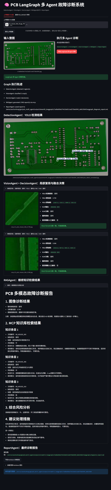

# PCB-MultiAgent: 面向工业 PCB 缺陷检测的多模态诊断与维修知识推理系统

本项目构建了一个面向工业 PCB 质检与维修场景的多模态多 Agent 诊断系统。系统以整张 PCB 图像为输入，落地 YOLO 缺陷定位、Qwen 结构化视觉诊断、MCP 工具化知识库与 LangGraph 多 Agent 状态编排，全自动完成缺陷发现、形态解释、风险研判、维修建议与诊断报告生成。

项目覆盖六类典型 PCB 缺陷：

- Short / 短路
- Open Circuit / 开路
- Mouse Bite / 鼠咬
- Spur / 毛刺
- Spurious Copper / 多余铜
- Missing Hole / 漏孔



---

## 1. 项目亮点

- **YOLO 定位 + Qwen 诊断的分层视觉方案**：YOLO11n 负责整图缺陷定位与初步类别判断，Qwen2.5-VL 负责对检测区域进行结构化视觉诊断，避免小缺陷直接在整图输入中被复杂线路背景干扰。
- **结构化 VisualDiagnosisAgent**：Qwen 不再只输出缺陷类别，而是生成缺陷确认、最终类型、细分形态、视觉证据、可返修性、维修建议、风险等级和人工复核原因等字段。
- **LangGraph 多 Agent 编排**：基于 DetectionAgent、VisualDiagnosisAgent、DecisionAgent、RAGAgent、ReportAgent 构建端到端诊断流程，实现检测、诊断、决策、检索和报告生成的状态化编排。
- **MCP 工具化维修知识库**：基于 Elasticsearch + bge-m3 构建 PCB 维修知识库，并封装 `pcb_knowledge_search` MCP 工具服务，使 Agent 可以通过标准工具接口检索成因分析、风险说明、检测方法和维修建议。
- **分级 Qwen 调用与人工复核机制**：支持 `auto / always / never` 三种 Qwen 调用模式；DecisionAgent 综合 YOLO 置信度、Qwen 诊断结论和风险等级，判断最终类别、决策置信度与是否需要人工复核。
- **Streamlit 可视化 Demo**：支持整图上传、PCB_DATASET 样例选择、检测框展示、局部 crop 展示、结构化视觉诊断、RAG 维修建议展示和 Markdown 报告下载。

---

## 2. 系统架构

整体流程如下：

```text
PCB image
  ↓
DetectionAgent: YOLO11n defect detection
  ↓
VisualDiagnosisAgent: Qwen2.5-VL structured visual diagnosis
  ↓
DecisionAgent: YOLO confidence + Qwen diagnosis fusion
  ↓
RAGAgent: MCP tool call + PCB maintenance knowledge retrieval
  ↓
ReportAgent: structured diagnosis report generation
```

系统由五个核心 Agent 组成：

| Agent | 功能 |
| --- | --- |
| DetectionAgent | 调用 YOLO11n 对整张 PCB 图像进行缺陷定位，输出检测框、YOLO 类别、置信度和可视化检测图。 |
| VisualDiagnosisAgent | 根据检测框裁剪局部 crop，并调用 Qwen2.5-VL 生成结构化视觉诊断结果，包括缺陷确认、细分形态、视觉证据、可返修性、风险等级和维修建议。 |
| DecisionAgent | 融合 YOLO 置信度、Qwen 诊断结果、风险等级和类型冲突情况，判断最终缺陷类别、决策置信度以及是否需要人工复核。 |
| RAGAgent | 通过 MCP 工具服务 `pcb_knowledge_search` 检索 PCB 维修知识库，返回成因分析、风险说明、检测方法、维修建议、复测方法和预防措施。 |
| ReportAgent | 汇总 YOLO 检测、Qwen 视觉诊断、融合决策和 RAG 知识内容，生成结构化 Markdown 诊断报告。 |

---

## 3. 技术栈

| 模块 | 技术 |
| --- | --- |
| 目标检测 | YOLO11n, Ultralytics |
| 多模态视觉模型 | Qwen2.5-VL-7B-Instruct |
| 微调方法 | LoRA, LLaMA-Factory |
| 向量模型 | bge-m3 |
| 知识库检索 | Elasticsearch |
| 工具服务 | MCP |
| Agent 编排 | LangGraph |
| 前端展示 | Streamlit |
| 深度学习框架 | PyTorch |
| 主要语言 | Python |

---

## 4. 数据处理

项目使用 PCB_DATASET 数据集，包含六类 PCB 缺陷图像和 XML 标注文件。原始 XML 标注被转换为两类训练数据。

### 4.1 YOLO 检测数据

将 XML 中的缺陷框转换为 YOLO 格式：

```text
class_id x_center y_center width height
```

用于训练 YOLO11n 缺陷定位模型。

### 4.2 Qwen2.5-VL crop-level 多模态数据

根据 XML 标注框裁剪局部缺陷图像，构造 Qwen2.5-VL 多模态指令数据：

```text
输入：PCB 局部缺陷 crop 图像
指令：请判断该 PCB 局部缺陷图像的缺陷类型
输出：缺陷类型：xxx
```

这种设计将模型输入从“整张复杂 PCB 图像”缩小到“局部缺陷区域”，降低线路背景干扰，使 VLM 更容易聚焦缺陷形态。

---

## 5. 模型训练与评测结果

### 5.1 YOLO11n 缺陷定位模型

YOLO11n 在 PCB_DATASET 验证集上的检测结果：

| Metric | Value |
| --- | --- |
| Precision | 0.953 |
| Recall | 0.927 |
| mAP50 | 0.968 |
| mAP50-95 | 0.534 |

### 5.2 Qwen2.5-VL crop 分类模型

使用 LLaMA-Factory 对 Qwen2.5-VL-7B-Instruct 进行 LoRA 微调。

| Metric | Value |
| --- | --- |
| Validation crops | 280 |
| Accuracy | 90.71% |

该模型在局部 crop 输入下可以较稳定地识别 PCB 缺陷类型，为后续结构化视觉诊断提供视觉理解基础。

### 5.3 LangGraph + MCP 端到端系统评测

在 YOLO 验证集 69 张 PCB 图像上进行端到端流程实验：

| Metric | Value |
| --- | --- |
| Total samples | 69 |
| Flow success rate | 100% |
| YOLO detection rate | 100% |
| Image-level defect accuracy | 100% |
| RAG hit rate | 100% |
| Human review trigger rate | 30.43% |
| Bad cases | 0 |

说明系统能够稳定完成：

```text
整图输入 → 缺陷定位 → 视觉诊断 → 融合决策 → 知识检索 → 报告生成
```

> 说明：上述端到端指标来自验证集流程实验。若后续调整 Qwen Prompt、调用策略或 DecisionAgent 规则，建议重新运行评测脚本并以最新实验结果为准。

---

## 6. 结构化视觉诊断设计

新版系统中，Qwen2.5-VL 不再只作为分类复核模型，而是作为 `VisualDiagnosisAgent` 输出结构化视觉诊断 JSON。

示例输出：

```json
{
  "defect_confirmed": "yes",
  "final_type": "漏孔",
  "subtype": "孔位缺失",
  "visual_evidence": "图像显示一个明显的圆形开口，周围没有可见连接或填充。",
  "repairability": "可返修",
  "direct_repair_suggestion": "建议使用合适材料修补孔位，并进行通断和可靠性复测。",
  "risk_level": "低",
  "need_human_review": false,
  "review_reason": ""
}
```

主要字段含义：

| 字段 | 含义 |
| --- | --- |
| `defect_confirmed` | Qwen 是否确认该区域存在缺陷。 |
| `final_type` | Qwen 视觉诊断后的缺陷类型。 |
| `subtype` | 更细粒度的缺陷形态描述。 |
| `visual_evidence` | 模型观察到的视觉依据。 |
| `repairability` | 是否具备返修可能。 |
| `direct_repair_suggestion` | 基于视觉诊断给出的初步维修动作。 |
| `risk_level` | 风险等级。 |
| `need_human_review` | 是否建议人工复核。 |
| `review_reason` | 触发人工复核的原因。 |

---

## 7. Qwen 调用控制策略

由于 Qwen2.5-VL 推理成本和显存占用较高，系统提供三种调用模式：

| 模式 | 说明 |
| --- | --- |
| `always` | 对所有 YOLO 检测框调用 Qwen，适合调试和效果展示。 |
| `never` | 不调用 Qwen，仅使用 YOLO 初判结果和 RAG 知识生成报告。 |
| `auto` | 仅对低置信、高风险或同类代表性检测框调用 Qwen，在效果和成本之间折中。 |

`auto` 模式下，系统会优先选择：

```text
低置信检测框
高风险缺陷框
同类缺陷中置信度最高的代表性区域
```

这样可以避免对同一类高置信重复缺陷区域无意义地多次调用 VLM，从而降低推理耗时和显存压力。

---

## 8. MCP 工具服务

本项目封装了 MCP 工具：

```text
pcb_knowledge_search
```

输入示例：

```json
{
  "query": "漏孔缺陷会导致什么风险，如何维修？",
  "defect_type": "漏孔",
  "top_k": 3
}
```

输出包括：

- 缺陷类型
- 文档编号
- 维修知识标题
- 风险等级
- 视觉特征
- 可能成因
- 检测方法
- 维修建议
- 复测方法
- 预防措施

测试命令：

```bash
python mcp_server/test_mcp_client.py
```

MCP stdio 模式要求 stdout 只传输 JSON-RPC 消息，因此 MCP Server 中将普通日志重定向到 stderr，避免 Elasticsearch、向量模型加载日志污染协议。

---

## 9. LangGraph 多 Agent 流程

运行单张图像诊断：

```bash
python scripts/test_langgraph_pipeline.py \
  --image path/to/pcb_image.jpg \
  --conf 0.50 \
  --imgsz 1024 \
  --rag_backend mcp
```

输出包括：

- YOLO 检测可视化图
- 局部 crop 图像
- Qwen 结构化视觉诊断结果
- DecisionAgent 融合决策结果
- MCP/RAG 维修建议
- Markdown 诊断报告

---

## 10. Streamlit 可视化 Demo

启动 LangGraph + MCP 版本前端：

```bash
streamlit run app_langgraph.py \
  --server.address 0.0.0.0 \
  --server.port 8502
```

功能包括：

- 上传整张 PCB 图像
- 使用 PCB_DATASET 样例图像
- 显示 YOLO 检测框和置信度
- 显示局部 crop 图像
- 显示 Qwen 诊断状态、缺陷确认、细分形态、视觉证据、可返修性、风险等级和维修建议
- 显示 DecisionAgent 最终融合类别、决策置信度和人工复核原因
- 显示 MCP/RAG 维修知识检索结果
- 下载 Markdown 诊断报告

前端交互逻辑：

```text
初始页面不默认显示图片；
上传图像后才显示诊断区域；
加载 PCB_DATASET 样例后才显示样例图；
清空上传图或样例图后，图片与诊断区域同步清空。
```

---

## 11. GPU 与运行环境说明

主前端进程可通过环境变量指定 YOLO 和 Qwen 使用的 GPU：

```bash
export CUDA_VISIBLE_DEVICES=2
export PCB_DEVICE=cuda:0
export PCB_VLM_DEVICE=cuda:0
export PCB_YOLO_DEVICE=0
```

含义是：物理 GPU 2 在当前进程内被映射为 `cuda:0`。

MCP RAG 子进程可以自动选择空闲 GPU：

```bash
export PCB_MCP_DEVICE=auto
export PCB_MCP_EXCLUDE_GPUS=0,1
export PCB_MCP_MIN_FREE_MIB=2048
```

这样可以避免 bge-m3 / SentenceTransformer 默认挤占已满的 GPU 0。

---

## 12. 项目目录结构

```text
.
├── app.py
├── app_langgraph.py
├── agent
│   ├── diagnosis_pipeline.py
│   ├── pcb_graph_state.py
│   └── pcb_langgraph.py
├── rag
│   └── knowledge_search.py
├── mcp_server
│   ├── pcb_knowledge_server.py
│   └── test_mcp_client.py
├── scripts
│   ├── convert_pcb_xml_to_yolo.py
│   ├── make_pcb_crop_cls_dataset.py
│   ├── eval_langgraph_end_to_end.py
│   ├── eval_langgraph_yolo_val.py
│   └── test_langgraph_pipeline.py
├── configs
├── data
│   └── knowledge_base
│       └── processed
│           └── pcb_fault_knowledge.jsonl
├── docs
│   ├── assets
│   │   └── streamlit-demo.png
│   └── evaluation
├── requirements.txt
├── .gitignore
└── README.md
```

---

## 13. 注意事项

本仓库不包含以下大文件：

- Qwen2.5-VL 模型权重
- bge-m3 模型权重
- YOLO 训练权重
- PCB 原始数据集
- Elasticsearch 运行目录
- 训练输出目录
- Streamlit 临时输出目录

请根据自己的环境准备模型和数据，并修改代码中的路径配置。

关键路径示例：

```text
models/Qwen2.5-VL-7B-Instruct
models/bge-m3
output/yolo_pcb_detect/.../best.pt
output/qwen25vl_7b_pcb_crop_cls_full
```

建议不要将以下内容提交到 GitHub：

```text
models/
output/
outputs/
runs/
es_logs/
__pycache__/
*.pt
*.pth
*.safetensors
*.bin
*.zip
```

---

## 14. 简历描述参考

```text
PCB-MultiAgent：面向工业 PCB 缺陷检测的多模态诊断与维修知识推理系统。项目集成 YOLO11n、Qwen2.5-VL LoRA、Elasticsearch + bge-m3、MCP、LangGraph 和 Streamlit，落地缺陷定位、结构化视觉诊断、融合决策、维修知识检索与报告生成。YOLO11n 验证集 mAP50 达到 0.968，Qwen2.5-VL crop 分类准确率达到 90.71%；在验证集流程实验中，图像级诊断准确率和 RAG 命中率均达到 100%，人工复核触发率为 30.43%。
```

---

## 15. License

This project is for research and learning purposes only.
